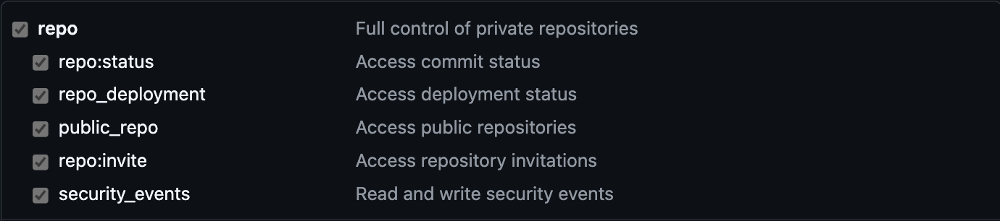
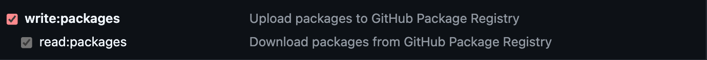

# XpeApp - Android mobile application

## Description

This is a mobile application for Android devices made with Jetpack Compose.

## Getting Started

### Prerequisites

- Android Studio
- Android SDK

### Android

This is an Android project. You can open it with Android Studio and run it on an emulator or a physical device.

For more information about Android SDK please visit the [Android Developer website](https://developer.android.com/).

### Kotlin

Kotlin is the programming language used in this project. This is a modern programming language that is fully interoperable with Java.

You can learn more about Kotlin on the [Kotlin website](https://kotlinlang.org/).

### Jetpack Compose

Jetpack Compose is a modern toolkit for building native Android UI. It simplifies and accelerates UI development on Android.

You can learn more about Jetpack Compose on the [Android Developer website](https://developer.android.com/jetpack/compose).

## Configuration

## google-services.json

This application works with `Firebase` and require a `google-services.json` file to be placed in the `app` directory.

Please refer to an administrator to get this file.

### Properties

This application require two properties to be set in the `app/config/uat.properties` for `UAT` and `app/config/prod.properties` for `PROD`.

```properties
BACKEND_URL="https://api.example.com"
ENVIRONMENT="uat"
```

The `BACKEND_URL` is the URL of the backend API and the `ENVIRONMENT` is the environment of the application.

### Xpeho UI

This application use the android part of the ui library of XPEHO imported from its [own repository](https://github.com/XPEHO/xpeho_ui_android).

#### Import

In this project with need to setup this file on our computer `.zshrc`:
(With a mac/linux use this command `nano ~/.zshrc` or code `.zshrc`)

```zshrc
#Github
export GITHUB_USER="your_github_username"
export GITHUB_TOKEN="your_github_token"
```

In order to generate the `github_token`, you need to follow the [documentation](https://docs.github.com/en/authentication/keeping-your-account-and-data-secure/creating-a-personal-access-token). the tokken classic part.

Make sure to generate a PAT (Personal Access Token) on your github account following the [documentation](https://docs.github.com/en/authentication/keeping-your-account-and-data-secure/managing-your-personal-access-tokens#creating-a-personal-access-token-classic).

You need to allow the following rights :



## Deployment

Follow the Bookstack documentation : _Mobilité/Android/Comment uploader une release sur Google Play Console_
